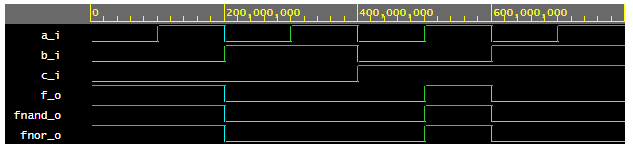

| **c** | **b** |**a** | **f(c,b,a)** |
| :-: | :-: | :-: | :-: |
| 0 | 0 | 0 |  |
| 0 | 0 | 1 |  |
| 0 | 1 | 0 |  |
| 0 | 1 | 1 |  |
| 1 | 0 | 0 |  |
| 1 | 0 | 1 |  |
| 1 | 1 | 0 |  |
| 1 | 1 | 1 |  |

https://www.edaplayground.com/x/EPr9

https://www.edaplayground.com/x/mHgZ

