# Vivado tutorial

First you need to create new project in vivado: File->Project->New

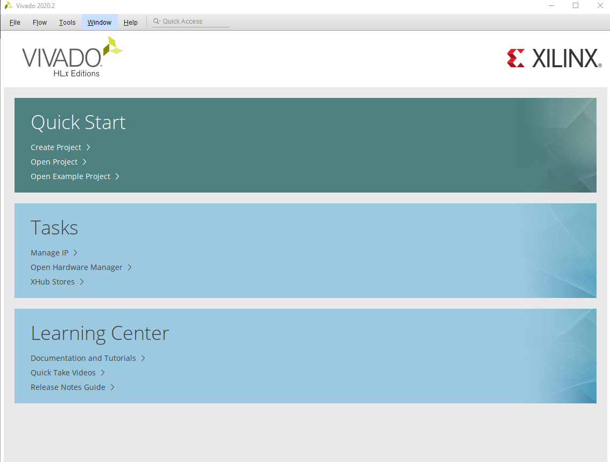

In the next window, name your project and choose desired project location

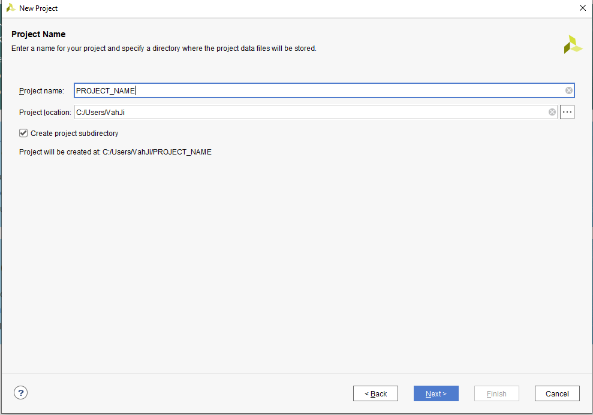

In the next step you need to select project type, in our case it will be an RTL project

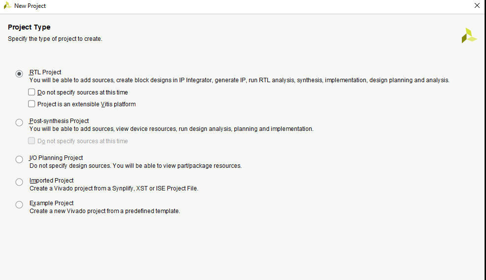

Then you will be asked to add sources to your project, click create file, choose its type and name. We will chooses VHDL type.

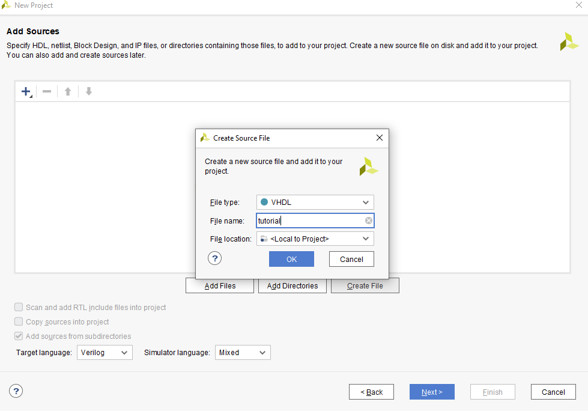

Now you will be asked to add constraints. Constrains connect your code to actual hardware. We will not need this. Go ahead and press next

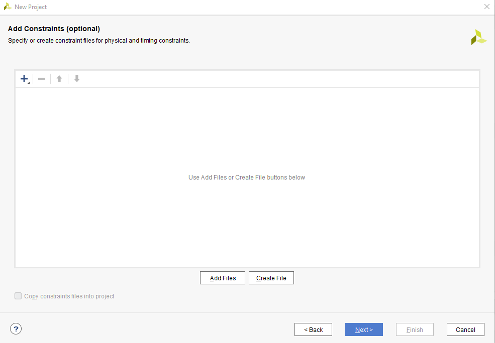

Now we can choose part associated with our project, either stock parts and boards directly from Vivado or you can import boards of your choosing directly in  the Vivado directory

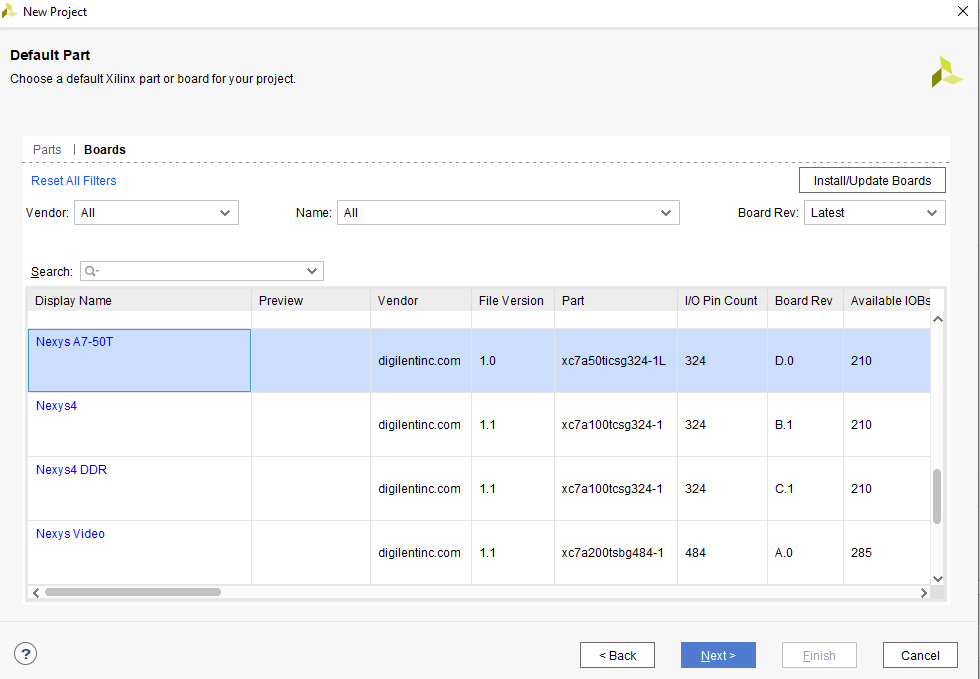

Next window that will appear will summarize your project

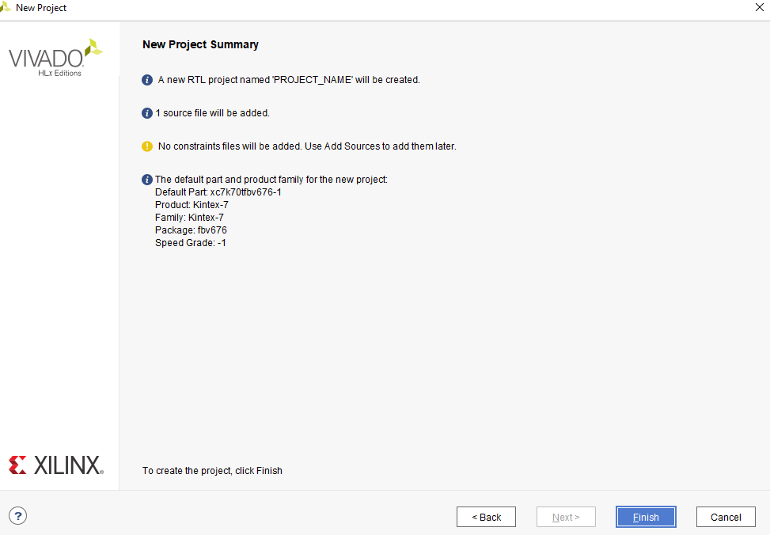

After that you will be asked to define I/O ports, this step will just be skipped in our case.

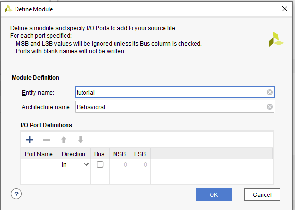

Your source will appear in the sources box, just double click in and edit your code

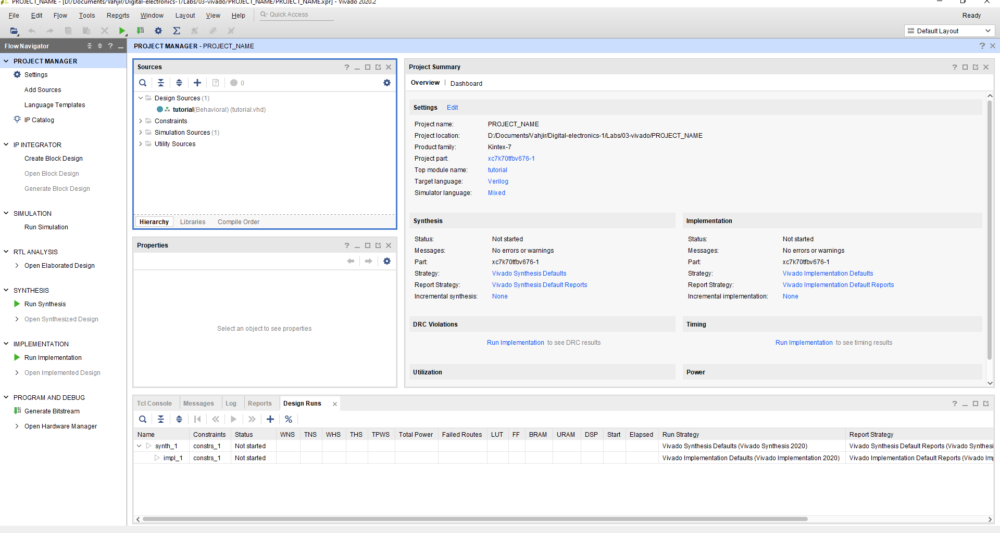

If you want to run a simulation, you will have to add simulation source, for that click: File->Add sources and select add simulation source

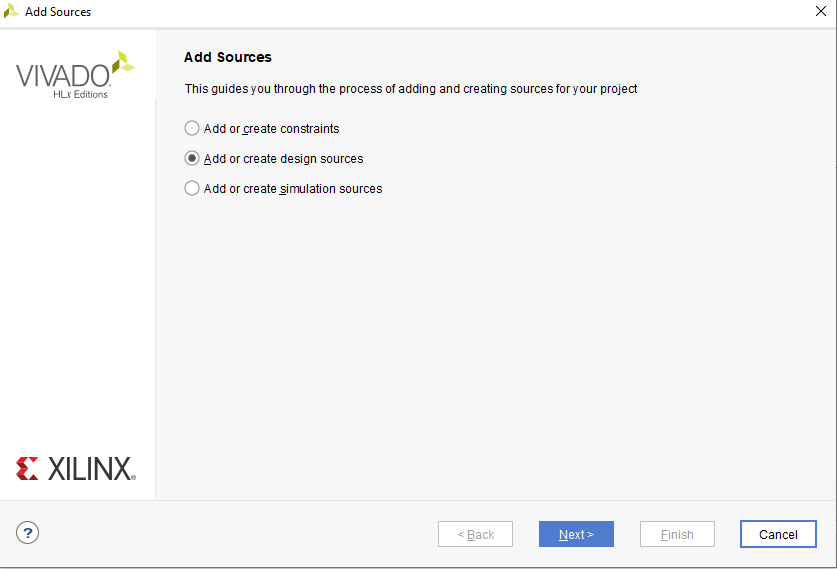

Same as we did before, we will name our source file and select its type

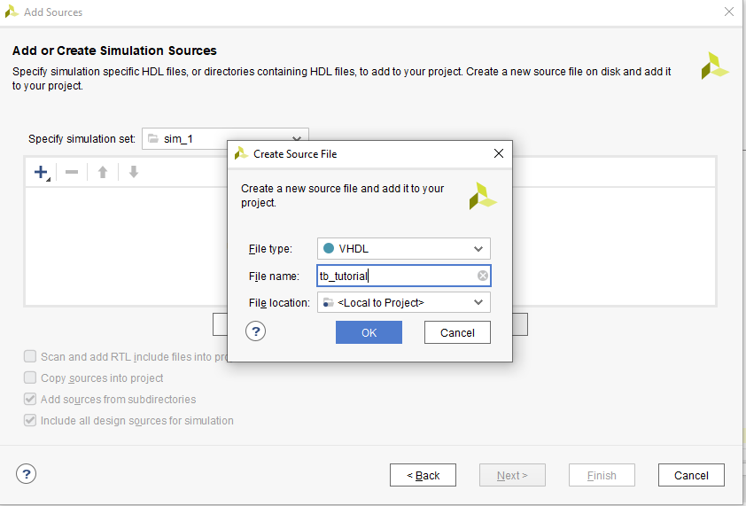

The simulation source will also appear in the sources window under: Sim. sources->sim1

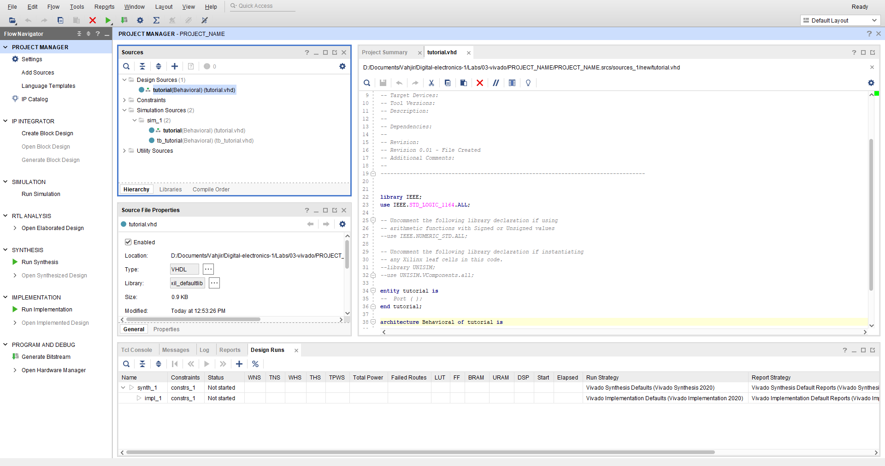

To run the simulation click flow and run behav. sim.