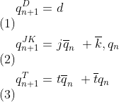
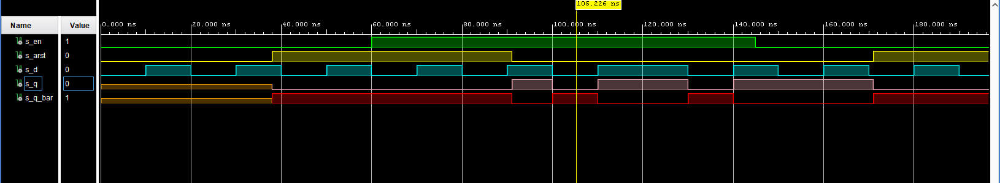
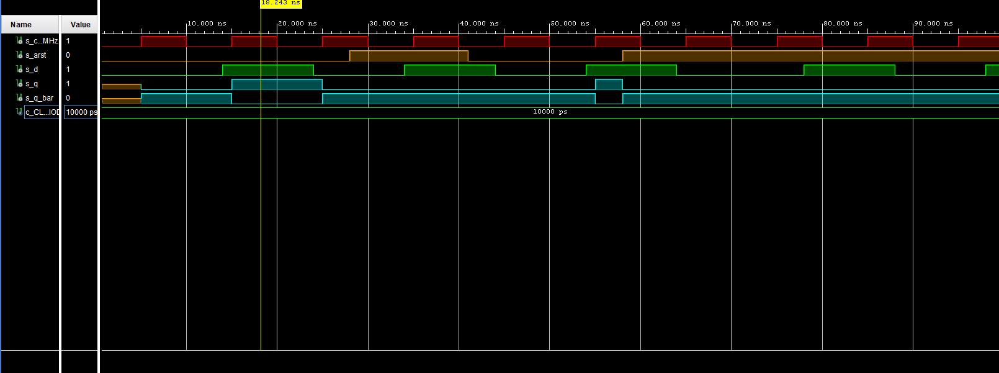
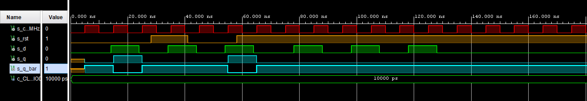
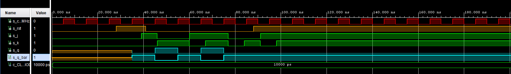
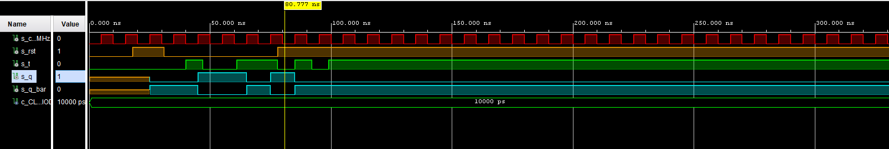
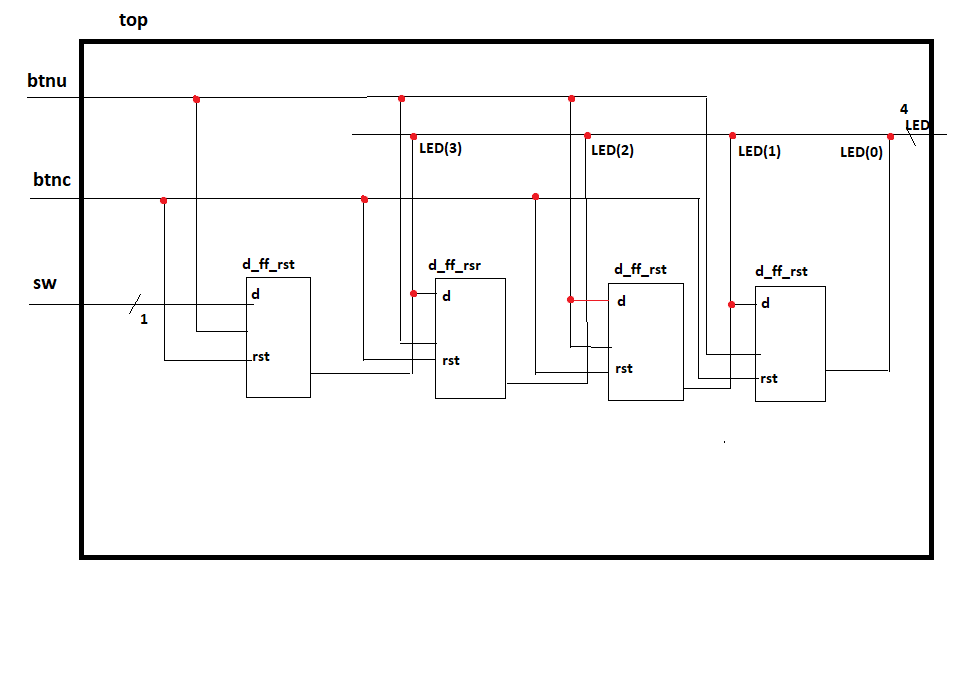

# 									07-ffs

### Preparation tasks:

#### Characteristic equations and completed tables for D, JK, T flip-flops:



|             **clk**              | **d** | **q(n)** | **q(n+1)** | **Comments**                                    |
| :------------------------------: | :---: | :------: | :--------: | :---------------------------------------------- |
|  |   0   |    0     |     0      | Input signal is stored to FF at the rising edge |
|  |   0   |    1     |     0      | Input signal is stored to FF at the rising edge |
|  |   1   |    0     |     1      | Input signal is stored to FF at the rising edge |
|  |   1   |    1     |     1      | Input signal is stored to FF at the rising edge |


|             **clk**              | **j** | **k** | **q(n)** | **q(n+1)** | **Comments** |
| :------------------------------: | :---: | :---: | :------: | :--------: | :----------- |
|  |   0   |   0   |    0     |     0      | No change    |
|  |   0   |   0   |    1     |     1      | No change    |
|  |   0   |   1   |    0     |     0      | Reset        |
|  |   0   |   1   |    1     |     0      | Reset        |
|  |   1   |   0   |    0     |     1      | Set          |
|  |   1   |   0   |    1     |     1      | Set          |
|  |   1   |   1   |    0     |     1      | Toggle       |
|  |   1   |   1   |    1     |     0      | Toggle       |

|             **clk**              | **t** | **q(n)** | **q(n+1)** | **Comments** |
| :------------------------------: | :---: | :------: | :--------: | :----------- |
|  |   0   |    0     |     0      | No change    |
|  |   0   |    1     |     1      | No change    |
|  |   1   |    0     |     1      | Invert       |
|  |   1   |    1     |     0      | Invert       |

### D latch:

#### VHDL code listing of the process `p_d_latch` with syntax highlighting:

```vhdl
p_d_latch : process(d, arst, en)
begin
    if (arst = '1') then
            q <= '0';
        q_bar <= '1';
        
    elsif
       (en = '1') then
            q <= d;
        q_bar <= not d;
    end if;
end process p_d_latch;
```

#### Listing of VHDL reset and stimulus processes from the testbench `tb_d_latch.vhd` file with syntax highlighting and asserts:

```vhdl
 p_stimulus : process
    begin
        report "Stimulus process started" severity note;
        
        s_d  <= '0';
        s_en <= '0';
        
        --d sekv
        wait for 10 ns;
        s_d  <= '1';
        wait for 10 ns;
        s_d  <= '0';
        wait for 10 ns;
        s_d  <= '1';
        wait for 10 ns;
        s_d  <= '0';
        wait for 5 ns;
        
        assert ((s_arst = '1') and (s_en = '0') and (s_q = '0') and (s_q_bar = '1'))
        report "Test failed for: reset='1', en='0' when s_d = '0'" severity error;
        
        wait for 5 ns;
        s_d  <= '1';
        wait for 5 ns;
        
        assert ((s_arst = '1') and (s_en = '0') and (s_q = '0') and (s_q_bar = '1'))
        report "Test failed for reset='1', en='0' when s_d = '1'" severity error;
        
        wait for 5 ns;
        s_d  <= '0';
        --/d sekv
        
        s_en <= '1';
        
        --d sekv
        wait for 10 ns;
        s_d  <= '1';
        wait for 5 ns;
        
        assert ((s_arst = '1') and (s_en = '1') and (s_q = '0') and (s_q_bar = '1'))
        report "Test failed for reset='1', en='1' when s_d = '1'" severity error;
        
        wait for 5 ns;
        s_d  <= '0';
        wait for 5 ns;
        
        assert ((s_arst = '1') and (s_en = '1') and (s_q = '0') and (s_q_bar = '1'))
        report "Test failed for reset='1', en='10' when s_d = '0'" severity error;          
        
        wait for 5 ns;
        s_d  <= '1';
        wait for 10 ns;
        s_d  <= '0';
        wait for 10 ns;
        s_d  <= '1';
        wait for 5 ns;
        
        assert ((s_arst = '0') and (s_en = '1') and (s_q = '1') and (s_q_bar = '0'))
        report "Test failed for reset='0', en='1' when s_d = '1'" severity error;
        
        wait for 15 ns;
        s_d  <= '0';
        wait for 5 ns;
        
        assert ((s_arst = '0') and (s_en = '1') and (s_q = '0') and (s_q_bar = '1'))
        report "Test failed for reset='0', en='1' when s_d = '0'" severity error;
        
        --/d sekv
        
        --d sekv
        wait for 5 ns;
        s_d  <= '1';
        wait for 5 ns;
        s_en <= '0';
        wait for 5 ns;
        s_d  <= '0';
   
        wait for 10 ns;
        s_d  <= '1';
        wait for 10 ns;
        s_d  <= '0';
        wait for 10 ns;
        s_d  <= '1';
        wait for 10 ns;
        s_d  <= '0';
        --/d sekv
        
        
    
        report "Stimulus process finished" severity note;
        wait;
    end process p_stimulus;
```

#### Screenshot with simulated time waveforms:




### Flip-flops:

#### p_d_ff_arst:

```vhdl
p_d_ff_arst : process (clk, arst)
begin
    if (arst = '1') then
        q <= '0';
        q_bar <= '1';
            
   elsif
      rising_edge(clk) then
        q <= d;
        q_bar <= not d;
    end if;
end process p_d_ff_arst;
```



#### p_d_ff_rst:

```vhdl
d_ff_rst : process (clk)
begin
  if rising_edge(clk) then
            if (rst = '1') then
                q <= '0';
                q_bar <= '1';
            else
                q <= d;
                q_bar <= not d;
            end if;
        end if;
end process d_ff_rst;

```



#### p_jk_ff_rst:

```vhdl
p_jk_ff_rst : process (clk)
begin
   if rising_edge(clk) then
     if (rst ='1') then
         s_q <= '0';
     else
        if (j = '0' and k= '0') then
            s_q <= s_q;
        elsif (j = '0' and k = '1') then
            s_q <= '0';
        elsif (j = '1' and k = '0') then
            s_q <= '1';
        elsif (j = '1' and k = '1') then
            s_q <= not s_q;
      
        end if;    
     end if; 
   end if;
end process p_jk_ff_rst;
```



#### p_t_ff_rst:

```vhdl
p_t_ff_rst : process (clk)
begin
    if rising_edge(clk) then
        if (rst = '1') then
            s_q <= '0';
        elsif (t = '1') then
            s_q <= not s_q;
        end if;
    end if;

end process p_t_ff_rst;
```



#### Listing of VHDL clock, reset and stimulus processes from the testbench files with syntax highlighting and asserts:

```vhdl
 p_reset_gen : process
        begin
            s_arst <= '0';
            wait for 28 ns;
            
            -- Reset activated
            s_arst <= '1';
            wait for 13 ns;
    
            --Reset deactivated
            s_arst <= '0';
            
            wait for 17 ns;
            
            s_arst <= '1';
            wait for 33 ns;
            
            wait for 660 ns;
            s_arst <= '1';
    
            wait;
     end process p_reset_gen;

  
    -- Data generation process
  
    p_stimulus : process
    begin
        report "Stimulus process started" severity note;
        
        s_d  <= '0';
        
        --d sekv
        wait for 14 ns;
        s_d  <= '1';
        wait for 2 ns;
        
        assert ((s_arst = '0') and (s_q = '1') and (s_q_bar = '0'))
        report "Test failed for reset='0', after clk rising when s_d = '1'" severity error;
        
        wait for 8 ns;
        s_d  <= '0';
        wait for 6 ns;
       
        
        wait for 4 ns;
        s_d  <= '1';
        wait for 10 ns;
        s_d  <= '0';
        wait for 10 ns;
        s_d  <= '1';
        wait for 5 ns;
        
        -- verify that reset is truly asynchronous
        assert ((s_arst = '1') and (s_q = '0') and (s_q_bar = '1'))
        report "Test failed for reset='1', before clk rising when s_d = '1'" severity error;
        
        wait for 5 ns;
        s_d  <= '0';
        --/d sekv
        
        --d sekv
        wait for 14 ns;
        s_d  <= '1';
        wait for 10 ns;
        s_d  <= '0';
        wait for 10 ns;
        s_d  <= '1';
        wait for 10 ns;
        s_d  <= '0';
        wait for 10 ns;
        s_d  <= '1';
        wait for 10 ns;
        s_d  <= '0';
        --/d sekv
        
       
        report "Stimulus process finished" severity note;
        wait;
    end process p_stimulus;
```

### Shift register:



