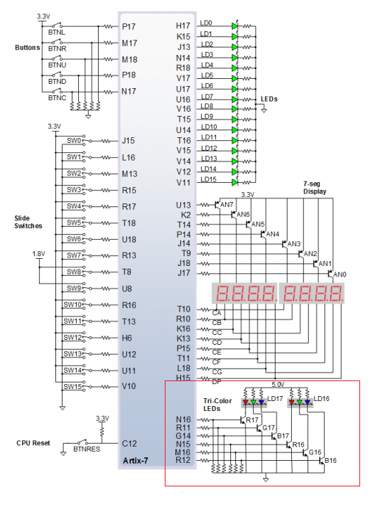
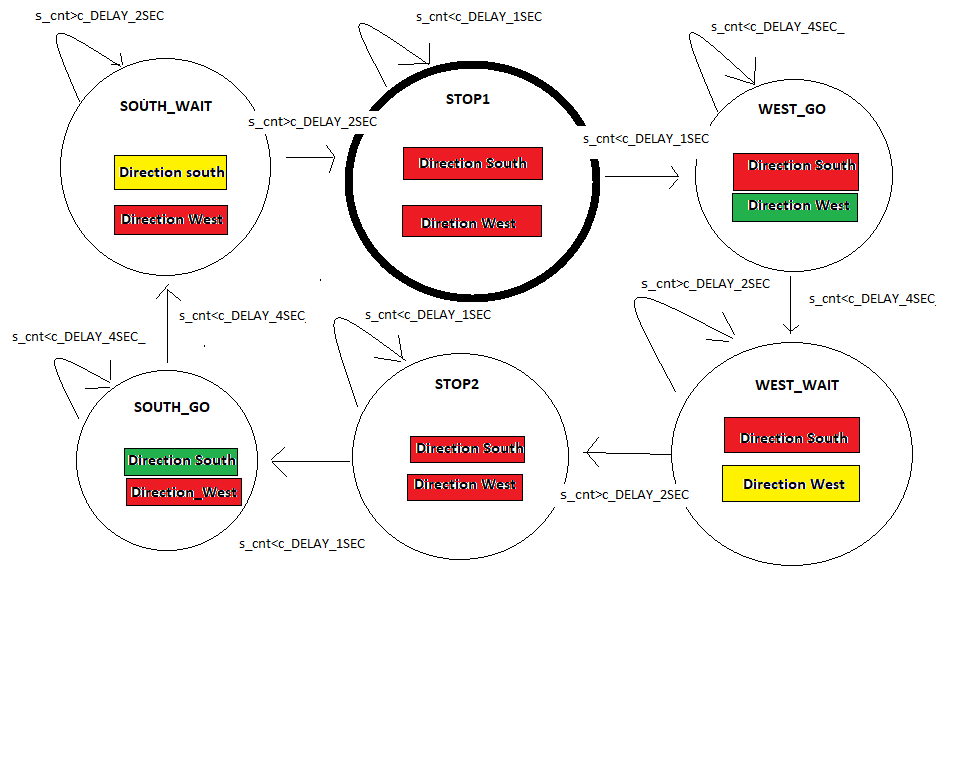
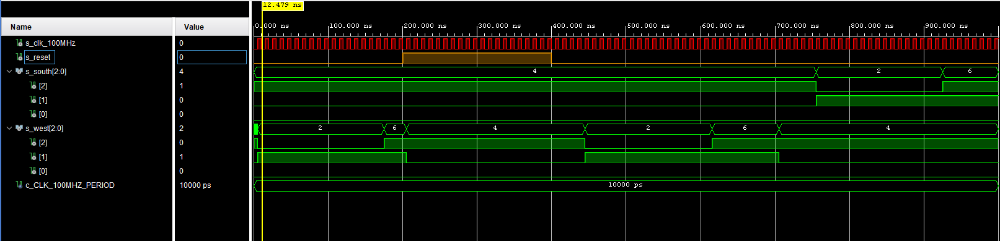
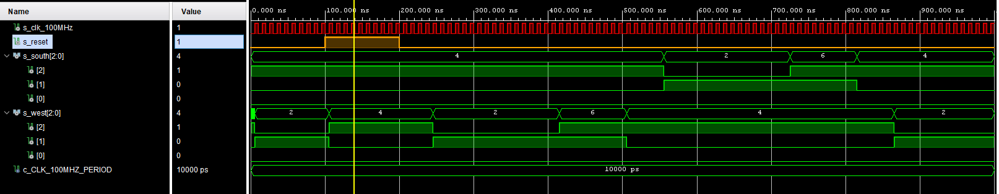

# 				LAB8 Traffic light controller

#### **Preparation task**

##### Completed state table:

| **Input P**  |               `0`                |               `0`                |               `1`                |               `1`                |               `0`                |               `1`                |               `0`                |               `1`                |               `1`                |               `1`                |               `1`                |               `0`                |               `0`                |               `1`                |               `1`                |               `1`                |
| :----------- | :------------------------------: | :------------------------------: | :------------------------------: | :------------------------------: | :------------------------------: | :------------------------------: | :------------------------------: | :------------------------------: | :------------------------------: | :------------------------------: | :------------------------------: | :------------------------------: | :------------------------------: | :------------------------------: | :------------------------------: | :------------------------------: |
| **Clock**    |  |  |  |  |  |  |  |  |  |  |  |  |  |  |  |  |
| **State**    |                A                 |                A                 |                B                 |                C                 |                C                 |                D                 |                A                 |                B                 |                C                 |                D                 |                B                 |                B                 |                B                 |                C                 |                D                 |                B                 |
| **Output R** |               `0`                |               `0`                |               `0`                |               `0`                |               `0`                |               `1`                |               `0`                |               `0`                |               `0`                |               `1`                |               `0`                |               `0`                |               `0`                |               `0`                |               `1`                |               `0`                |

##### Nexys7 A7 led connections:




| **RGB LED** | **Artix-7 pin names** | **Red** | **Yellow** | **Green** |
| :---------: | :-------------------: | :-----: | :--------: | :-------: |
|    LD16     |     N15, M16, R12     | `1,0,0` |  `1,1,0`   |  `0,1,0`  |
|    LD17     |     N16, R11, G14     | `1,0,0` |  `1,1,0`   |  `0,1,0`  |

#### Traffic light controller:

##### State diagram



##### Listing of VHDL code of sequential process `p_traffic_fsm` with syntax highlighting:

```vhdl
p_traffic_fsm : process(clk)
    begin
        if rising_edge(clk) then
            if (reset = '1') then       -- Synchronous reset
                s_state <= STOP1 ;      -- Set initial state
                s_cnt   <= c_ZERO;      -- Clear all bits

            elsif (s_en = '1') then
                -- Every 250 ms, CASE checks the value of the s_state 
                -- variable and changes to the next state according 
                -- to the delay value.
                case s_state is
                    when STOP1 =>
                        if (s_cnt < c_DELAY_1SEC) then
                            s_cnt <= s_cnt + 1;
                        else
                            s_state <= WEST_GO;
                            s_cnt   <= c_ZERO;
                        end if;

                    when WEST_GO =>
                        
                        if (s_cnt < c_DELAY_4SEC) then
                            s_cnt <= s_cnt + 1;
                        else
                            s_state <= WEST_WAIT;
                            s_cnt   <= c_ZERO;
                        end if;
                        
                    when WEST_WAIT =>
                        if (s_cnt < c_DELAY_2SEC) then
                            s_cnt <= s_cnt + 1;
                        else
                            s_state <= STOP2;
                            s_cnt   <= c_ZERO;
                        end if;
                    when STOP2 =>
                        if (s_cnt < c_DELAY_1SEC) then
                            s_cnt <= s_cnt + 1;
                        else
                            s_state <= SOUTH_GO;
                            s_cnt   <= c_ZERO;
                        end if;

                    when SOUTH_GO =>
                        if (s_cnt < c_DELAY_4SEC) then
                            s_cnt <= s_cnt + 1;
                        else
                            s_state <= SOUTH_WAIT;
                            s_cnt   <= c_ZERO;
                        end if;
                        
                    when SOUTH_WAIT =>
                        if (s_cnt < c_DELAY_2SEC) then
                            s_cnt <= s_cnt + 1;
                        else
                            s_state <= STOP1;
                            s_cnt   <= c_ZERO;
                        end if;
                    when others =>
                        s_state <= STOP1;

                end case;
            end if; -- Synchronous reset
        end if; -- Rising edge
    end process p_traffic_fsm;
```


##### Listing of VHDL code of combinatorial process `p_output_fsm` with syntax highlighting:

```vhdl
 p_output_fsm : process(s_state)
    begin
        case s_state is
            when STOP1 =>
                south_o <= "100";   -- Red (RGB = 100)
                west_o  <= "100";   -- Red (RGB = 100)
                
            when WEST_GO =>
                south_o <= "100";   -- Red (RGB = 100)
                west_o  <= "010";   -- GREEN (RGB = 010)
                
            when WEST_WAIT =>
                south_o <= "100";   -- Red (RGB = 100)
                west_o  <= "110";   -- YELLOW (RGB = 110)
                
            when STOP2 =>
                south_o <= "100";   -- Red (RGB = 100)
                west_o  <= "100";   -- Red (RGB = 100)
                
            when SOUTH_GO =>
                south_o <= "010";   -- GREEN (RGB = 010)
                west_o  <= "100";   -- Red (RGB = 100)
                
            when SOUTH_WAIT =>
                south_o <= "110";   -- YELLOW (RGB = 110)
                west_o  <= "100";   -- Red (RGB = 100)
            when others =>
                south_o <= "100";   -- Red
                west_o  <= "100";   -- Red
        end case;
    end process p_output_fsm;
```

##### Screenshots of the simulation:





#### Smart controller

##### State table:

| Current state | Direction<br />South | Direction<br />West | Delay | No cars | Cars<br />West | Cars<br />South | Cars both directions |
| ------------- | -------------------- | ------------------- | ----- | ------- | -------------- | --------------- | -------------------- |
| goS           | green                | red                 | >3s   | goS     | waitS          | goS             | waitS                |
| waitS         | yellow               | red                 | 0.5s  | goW     | goW            | goW             | goW                  |
| goW           | red                  | green               | >3s   | goW     | goW            | waitW           | waitW                |
| waitW         | red                  | yellow              | 0.5s  | goS     | goS            | goS             | goS                  |

##### State diagram:


##### Listing of VHDL code of sequential process `p_smart_traffic_fsm` with syntax highlighting:

```vhdl
    p_smart_traffic_fsm : process(clk)
    begin
        if rising_edge(clk) then
            if (reset = '1') then       -- Synchronous reset
                s_state <= goS ;        -- Set initial state
                s_cnt   <= c_ZERO;      -- Clear all bits

            elsif (s_en = '1') then
                case s_state is

                    when goS =>
                        if (s_cnt < c_DELAY_3SEC) then
                            s_cnt <= s_cnt + 1;
                        elsif (west_i = '1') then
                            s_state <= waitS;
                            s_cnt   <= c_ZERO;
                        end if;

                    when waitS =>
                        if (s_cnt < c_DELAY_0p5SEC) then
                            s_cnt <= s_cnt + 1;
                        else
                            s_state <= goW;
                            s_cnt   <= c_ZERO;
                        end if;
                    
                    when goW =>
                        if (s_cnt < c_DELAY_3SEC) then
                            s_cnt <= s_cnt + 1;
                        elsif (south_i = '1') then
                            s_state <= waitW;
                            s_cnt   <= c_ZERO;
                        end if;
                        
                    when waitW =>
                        if (s_cnt < c_DELAY_0p5SEC) then
                            s_cnt <= s_cnt + 1;
                        else
                            s_state <= goS;
                            s_cnt   <= c_ZERO;
                        end if; 
                    when others =>
                        s_state <= goS;

                end case;
            end if; -- Synchronous reset
        end if; -- Rising edge
    end process p_smart_traffic_fsm;

```

